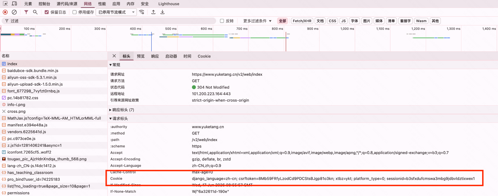
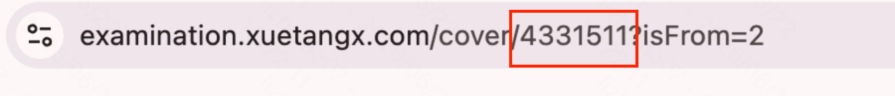

# RainExam 

**雨课堂在线考题提取 & AI 自动解答工具**

一键拉取雨课堂在线试卷，提取为文本文件，可选 AI 自动答题。

---

## 一分钟上手

### 🪟 Windows

```
① 下载本项目的 ZIP 并解压
② 双击 run.bat                    ← 脚本自动检查环境、装依赖、引导配置
③ 第一次运行时会提示填入 Cookie    ← 按 F12 从浏览器复制粘贴即可
④ 输入试卷 ID，回车，搞定！
```

### 🍎 macOS

```bash
① 下载本项目 ZIP 并解压
② 打开终端，cd 到项目目录
③ bash setup.sh                   ← 自动检查环境、装依赖、引导配置
④ 按提示操作即可
```

---

## 如果你比较熟悉命令行

```bash
cp .env.example .env      # 创建配置
# 编辑 .env 填入 Cookie

pip install openai httpx  # 装依赖
python extract_questions.py --exam-id 4361438           # 仅提取
python extract_questions.py --exam-id 4361438 --answer  # 提取 + AI 解答
```

---

## Cookie 获取方式

1. 用浏览器打开雨课堂在线考试页面（**先登录**）
2. 按 **F12** → **Network** 标签 → 按 **F5** 刷新
3. 点击任意请求 → 复制 `Cookie` 的值
4. 粘贴到 `.env` 文件中的 `XT_COOKIE=` 后面

## 试卷ID获取方式
进入试卷页面可以从网址中看到



---

## 功能一览

| 功能 | 说明                                 |
|------|------------------------------------|
| 📥 **在线拉取** | 从雨课堂在线 API 直接获取试卷                  |
| 🔄 **题型支持** | 选择题 (A/B/C/D)、判断题 (T/F)、填空题        |
| 🤖 **AI 解答** | 支持任意 OpenAI 兼容 API（DeepSeek、通义千问等） |
| 📋 **答案速查** | 答案内联标注 + 文件末尾速查表                   |
| 📄 **文件输出** | 整张试卷输出到 `answer.txt`               |

---

## 配置参考（.env 文件）

```ini
XT_COOKIE=xt_lang=zh; x_access_token=...    # 必需
AI_API_KEY=sk-xxx                            # AI 解答时必需
AI_BASE_URL=https://api.deepseek.com/v1       # 可选，默认 OpenAI
AI_MODEL=deepseek-chat                        # 可选，默认 gpt-4o-mini
```

---

## License

MIT