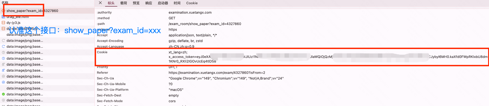
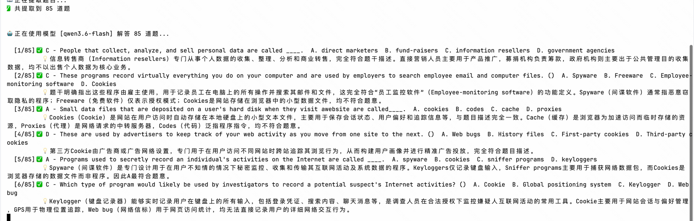

# RainExam 

**雨课堂在线考题提取 & AI 自动解答工具**

一键拉取雨课堂在线试卷，提取为文本文件，可选 AI 自动答题。  
支持两种模式：**考试模式**（在线考试试卷）和 **Quiz 模式**（随堂测验，图片化题目）。

---

## 一分钟上手

### 🪟 Windows（推荐：直接下载 EXE）

> **无需安装 Python**，下载即用！

1. 前往 [Releases 页面](../../releases/latest)
2. 找到 **Assets** 区域，点击 **`RainExam.exe`** 下载（⚠️ 不要下载 `Source code.zip`，那是源码）
3. 双击运行，会弹出图形界面
4. 在界面中填入 **XT_COOKIE** 和 **试卷 ID**，点击「保存配置」再点「开始运行」

<details>
<summary>🔧 旧方式：通过 run.bat 运行（需要已安装 Python）</summary>

```
① 下载本项目的 ZIP 并解压
② 双击 script/run.bat
③ 第一次运行时会提示填入 Cookie
④ 输入试卷 ID，回车
```
</details>

### 🍎 macOS

```bash
① 下载本项目 ZIP 并解压
② 打开终端，cd 到项目目录
③ bash setup.sh                   ← 自动检查环境、装依赖、引导配置
④ 按提示操作即可
```

---

## 如果你比较熟悉命令行

### 考试模式

```bash
cp .env.example .env      # 创建配置
# 编辑 .env 填入 Cookie

pip install openai httpx pywebview  # 装依赖
python src/extract_questions.py --exam-id 4361438           # 仅提取
python src/extract_questions.py --exam-id 4361438 --answer  # 提取 + AI 解答
```

### Quiz 模式

```bash
# 在 .env 中配置 QUIZ_ID 和 CLASSROOM_ID 后可直接运行：
python src/quiz.py

# 或者直接传参：
python src/quiz.py --quiz-id 4265823 --classroom-id 29288528
```

输出为 HTML 报告（含题目图片、正确答案标注、答案速查表），用浏览器打开即可查看。

---

## Cookie 获取方式

**方式一：GUI 自动获取（推荐）**  
在图形界面中点击「登录自动获取」按钮，在弹出的浏览器窗口中完成登录，Cookie 会自动填入。

**方式二：手动获取**
1. 用浏览器打开雨课堂在线考试页面（**先登录**）
2. 进入试卷详情
3. 按 **F12** → **Network** 标签 → 按 **F5** 刷新
4. 点击 `show_paper` 请求 → 复制 `Cookie` 的值
5. 粘贴到 `.env` 文件中的 `XT_COOKIE=` 后面

> ⚠️ 雨课堂会为每张试卷生成不同的 Token，每次使用需更新 Cookie



---

## 考试模式参数获取

### 试卷 ID

进入试卷页面，从网址中获取：


---

## Quiz 模式参数获取

### Quiz ID

进入雨课堂 Quiz 答题结果页面，从网址中的 `quiz_id` 参数获取：

```
https://www.yuketang.cn/...?quiz_id=4265823&...
                              ↑ 这就是 Quiz ID
```

### 课堂 ID (Classroom ID)

同样从网址中的 `classroom_id` 参数获取：

```
https://www.yuketang.cn/...?classroom_id=29288528&...
                              ↑ 这就是课堂 ID
```

> ⚠️ Quiz 模式的 Cookie 获取方式与考试模式相同，登录雨课堂后从 Network 面板复制即可。


---

## 功能一览

### 考试模式

| 功能 | 说明                                 |
|------|------------------------------------|
| 📥 **在线拉取** | 从雨课堂在线 API 直接获取试卷                  |
| 🔄 **题型支持** | 选择题 (A/B/C/D)、判断题 (T/F)、填空题        |
| 🤖 **AI 解答** | 支持任意 OpenAI 兼容 API（DeepSeek、通义千问等） |
| 📋 **答案速查** | 答案内联标注 + 文件末尾速查表                   |
| 📄 **文件输出** | 整张试卷输出到 `answer.txt`               |

### Quiz 模式

| 功能 | 说明                                 |
|------|------------------------------------|
| 📥 **在线拉取** | 从雨课堂 Quiz API 获取答题结果和题目图片         |
| 🖼️ **图片化题目** | 题干和选项均为图片，自动下载并嵌入报告           |
| ✅ **答案自带** | 正确答案直接从 API 获取，无需 AI 解答           |
| 📊 **作答对比** | 绿色标注正确答案，红色标注错误选择                |
| 📄 **HTML 报告** | 输出为 `quiz_<标题>.html`，浏览器打开即可查看    |

---
## 运行截图

---

## 配置参考（.env 文件）

```ini
# ── 通用 ──
XT_COOKIE=xt_lang=zh; x_access_token=...    # 必需（两种模式通用）

# ── Quiz 模式 ──
QUIZ_ID=xxx(这个每张试卷可能都不一样)                             # Quiz ID
CLASSROOM_ID=xxx(一般是固定的)                        # 课堂 ID

# ── 考试模式 + AI 解答 ──
AI_API_KEY=sk-xxx                            # AI 解答时必需
AI_BASE_URL=https://dashscope.aliyuncs.com/compatible-mode/v1
AI_MODEL=qwen3.6-flash
```

---

## License

MIT